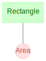

# Getting Started

## Installation

First, please install DataJoint via one of the following:

=== "Matlab ≥ R2016b (recommended)"

    1. Utilize MATLAB built-in GUI i.e. *Top Ribbon -> Add-Ons -> Get Add-Ons*
    2. Search and Select `DataJoint`
    3. Select *Add from GitHub*

=== "Matlab < R2016"

    1. Utilize MATLAB built-in GUI i.e. *Top Ribbon -> Add-Ons -> Get Add-Ons*
    2. Search and Select `DataJoint`
    3. Select *Download from GitHub*
    4. Save `DataJoint.mltbx` locally
    5. Navigate in MATLAB tree browser to saved toolbox file
    6. Right-Click and Select *Install*
    7. Select *Install*

=== "GHToolbox"

    1. Install *GHToolbox* using using an appropriate method in https://github.com/datajoint/GHToolbox
    2. run: `ghtb.install('datajoint/datajoint-matlab')`

=== "From source"

    1. Download `DataJoint.mltbx` locally
    2. Navigate in MATLAB tree browser to saved toolbox file
    3. Right-Click and Select *Install*
    4. Select *Install*

After installing, that you have the latest version from Matlab:

```matlab
>> dj.version
DataJoint version 3.5.0
```

## Connection

At the MATLAB command prompt, assign the environment variables with
the database credentials. For example, if you are connection to the
server `tutorial-db.datajoint.io` with username `alice` and password
`fake-password`, execute the following commands:

```matlab
setenv DJ_USER alice
setenv DJ_HOST tutorial-db.datajoint.io
setenv DJ_PASS 'fake-password'
```

!!! note

    Although you may connect to any MySQL server of your choice, the DataJoint company
    offers an online tutorial environment at `tutorial-db.datajoint.io`. Simply sign up
    for a free [DataJoint account](https://accounts.datajoint.io). You will be granted
    privileges to create schemas that are prefixed as `{user}_`.

You will need to execute these commands at the beginning of each DataJoint work session.
To automate this process, you might add these items to the Matlab
[startup.m](https://www.mathworks.com/help/matlab/ref/startup.html) script.

However, be careful not to share this file or commit it to a public directory (a common
mistake), as it contains a your login credentials in plain text. If you are not sure,
it is better not to set `DJ_PASS`, in which case DataJoint will prompt to enter the
password when connecting to the database.

To change the database password, use the following command

```matlab
>> dj.setPassword('my#cool!new*password')
```

And update your credentials in your startup script for the next session.

For more information on various settings, access help via `help('dj.config')` or review
it online
[here](https://github.com/datajoint/datajoint-matlab/blob/c2bd6b3e195dfeef773d4e12bad5573c461193b0/%2Bdj/config.m#L2-L27).

## Creating Schemas

A schema can be created either automatically using the `dj.createSchema`
script or manually. While `dj.createSchema` simplifies the process, we'll also highlight
the manual approach to demonstrate each step.

### Manual

We can create the database schema using the following command:
    
``` matlab
query(dj.conn, 'CREATE SCHEMA `{user}_my_schema`')
```

??? Note "Server privileges"

    You must have create privileges for the schema name pattern. It is a common practice
    to grant all privileges to users for schemas that begin with the username, in
    addition to some shared schemas. Thus the user `alice` would be able to perform any
    work in any schema that begins with `alice_`.

Next, we can create the MATLAB package.

DataJoint organizes schemas as MATLAB **packages**. If you are not
familiar with packages, please review:

-   [How to work with MATLAB packages](https://www.mathworks.com/help/matlab/matlab_oop/scoping-classes-with-packages.html)
-   [How to manage MATLAB's search paths](https://www.mathworks.com/help/matlab/search-path.html)

In your project directory, create the package folder, which must begin with a `+` sign.
For example, for the schema called `my_schema`, you would create the folder
`+my_schema`. Make sure that your project directory (the parent directory of your
package folder) is added to the MATLAB search path.

Finally, we'll associate the package with the database schema.

This step tells DataJoint that all classes in the package folder `+my_schema` will work
with tables in the database schema `{user}_my_schema`. Each package corresponds to
exactly one schema. In some special cases, multiple packages may all relate to a single
database schema, but in most cases there will be a one-to-one relationship between
packages and schemas.

In the `+my_schema` folder, create the file `getSchema.m` with the
following contents:

``` matlab
function obj = getSchema
persistent OBJ
if isempty(OBJ)
    OBJ = dj.Schema(dj.conn, 'experiment', 'alice_experiment');
end
obj = OBJ;
end
```

This function returns a persistent object of type `dj.Schema`,
establishing the link between the `my_schema` package in MATLAB and the
schema `{user}_my_schema` on the database server.

## Automatic

Alternatively, we can execute

``` matlab
>> dj.createSchema
```

This automated script will walk you through the steps above and will create the schema,
the package folder, and the `getSchema` function in that folder.

## Defining Tables

DataJoint provides the interactive script `dj.new` for creating a new table. It will
prompt to enter the new table's class name in the form `package.ClassName`. This will
create the file `+package/ClassName.m`.

For example, define the table `my_schema.Rectangle`

``` matlab
   >> dj.new
   Enter <package>.<ClassName>: my_schema.Rectangle

   Choose table tier:
     L=lookup
     M=manual
     I=imported
     C=computed
     P=part
    (L/M/I/C/P) > M
```

This will create the file `+my_schema.Rectangle.m` with the following
contents:

``` matlab
%{
# my newest table
# add primary key here
-----
# add additional attributes
%}
classdef Rectangle < dj.Manual
end
```

While `dj.new` adds a little bit of convenience, we can also create the classes from
scratch manually. Each newly created class must inherit from the DataJoint class
corresponding to the correct [data tier](../../reproduce/table-tiers): `dj.Lookup`,
`dj.Manual`, `dj.Imported` or `dj.Computed`.

The most important part of the table definition is the comment preceding the `classdef`.
DataJoint will parse this comment to define the table. The class will become usable
after you edit this comment. For example: 

File `+my_schema/Rectangle.m`

```matlab
%{
    shape_id: int
    ---
    shape_height: float
    shape_width: float
%}
classdef Rectangle < dj.Manual
end
```

File `+my_schema/Area.m`

```matlab
%{
    -> my_schema.Rectangle
    ---
    shape_area: float    
%}
classdef Area < dj.Computed
end
```

The table definition is contained in the first block comment in the class definition
file. Note that although it looks like a mere comment, the table definition is parsed
by DataJoint. 

Users do not need to do anything special to have the table created in the database. The
table is created upon the first attempt to use the class for manipulating its data
(e.g. inserting or fetching entities).

Furthermore, DataJoint provides the `syncDef` method to update the `classdef` file
definition string for the table with the definition in the actual table:

``` matlab
  syncDef(my_schema.Area)    % updates the table definition in file +my_schema/Area.m
```

## Diagram

### Display

The diagram displays the relationship of the data model in the data pipeline.

This can be done for an entire schema, or multiple schema:

``` matlab
draw(dj.ERD(my_schema.getSchema))
% OR
erd my_schema
erd my_schema my_other_schema
```

Or for individual or sets of tables:
```python
erd my_schema.Rectangle
draw(dj.ERD(my_schema.Rectangle) + dj.ERD(my_schema.Area))
```



### Customize

Adding or substracting a number to a diagram object adds nodes downstream or upstream,
respectively, in the pipeline.

``` python
draw(dj.ERD(my_schema.Rectangle)+1) # (1)
```

1. Plot all the tables directly downstream from `my_schema.Rectangle`

```python
draw(dj.ERD(my_schema)-1+1) # (1)
```

1. Plot all tables directly downstream of those directly upstream of this schema.

## Add data

Let's add data for a rectangle:

```matlab
insert(my_schema.Rectangle, {1, 2, 4})
insert(my_schema.Rectangle, [{2, 2, 3},{3, 4, 2}])
```

## Run computation

Let's start the computations on our entity: `Area`.

```python
populate(my_schema.Rectangle)
```

## Query

Let's inspect the results.

```python
Area & 'shape_area >= 8'
```
